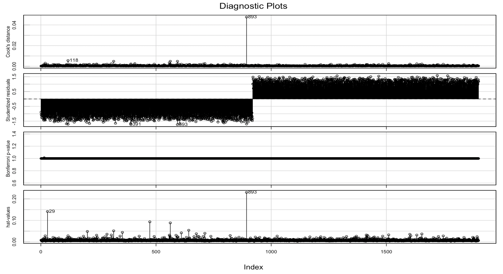

```{r setup, include=FALSE}
knitr::opts_chunk$set(echo = TRUE)
```

## Introduction & Background

This project aims to examine the potential association between 75 individual-level features such as socioeconomic status and health indicators, and depression onset. The original data come from a 2015 study conducted by the Busara Center in rural Siaya County in western Kenya; all study participants were asked to complete depression screening to determine the outcome of interest. (The Original Link is here: https://zindi.africa/competitions/busara-mental-health-prediction-challenge/data). From this heterogeneous data, we aim to use regression in investigating the association, and use machine learning methods in predicting individual level depression.

### EDA

First, we check for missing data included in our dataset. There are in total 23 out of 75 features that includes missing NAs. Since we have huge number of features included, it is understandable that there are very few observations with no missing values at all. We proceed with a naive approach by replacing the missing values with the mean for each feature.

I then chose to examine the covariates that I have a clear understanding for, since we need to identify potential confounding in the model and one cannot refer to the classical/epidemiological definition of confounding if they do not fully understand the nature of that factor. So we only have 20 features left for modeling the association. 

I proceeded with using an influence plot which graphs the studentized residuals against hat values ---- fitted values made by my logistic model, and the sizes and fill color of the red circles are proportional to Cook’s distance. We can see that there are around 4 points with large studentized residuals with their Cook’s distances labeled. We can see that although these 4 points are labeled because of their large residual values, none of the points have an absolute value larger than 3. Therefore we temporarily conclude that there is no obvious outlier in our dataset.


From the correlation matrix of all our covariates, we can observe that factors that are highly correlated (correlation > 0.6) include hhsize & children & hh_totalmembers & hhchildren, cons_nondurable and cons_allfood and cons_med_total. Therefore, we proceed to eliminate covariates that are highly correlated in our model. After further cleaning, we have the influenceIndexPlot below. 


### Description  & justification of Methodology

The data set is heavily imbalanced with only 16% of participants having the outcome of interest. Using imbalanced data set may result in poor outcomes in the ROC-AUC result. Therefore we generated a sample of synthetic data by Randomly Over Sampling Examples (ROSE) which resulted in a roughly balanced data set to combat this problem. 

From the ROC curve of a general logistic regression fitted for this dataset, we can see that it comes quite closer to the diagonal line, indicating low accuracy. From the general model summary, we can also see that most of the covariates are not statistically significant in the classification. This may be due to the fact that the linearity assumption in the predictors does not hold well. 

Therefore we can conclude that this general linear model is not sufficient to depict the relationship of the covariates listed and the outcome of interest depression status. We proceed with other machine learning approaches. 


## Results

We first drop unnecessary features for our analysis such as village identifier, personal identification number and the survey date. We then create initial data partition for further examination.  


### Logistic Regression with tuned parameters


### kNN


