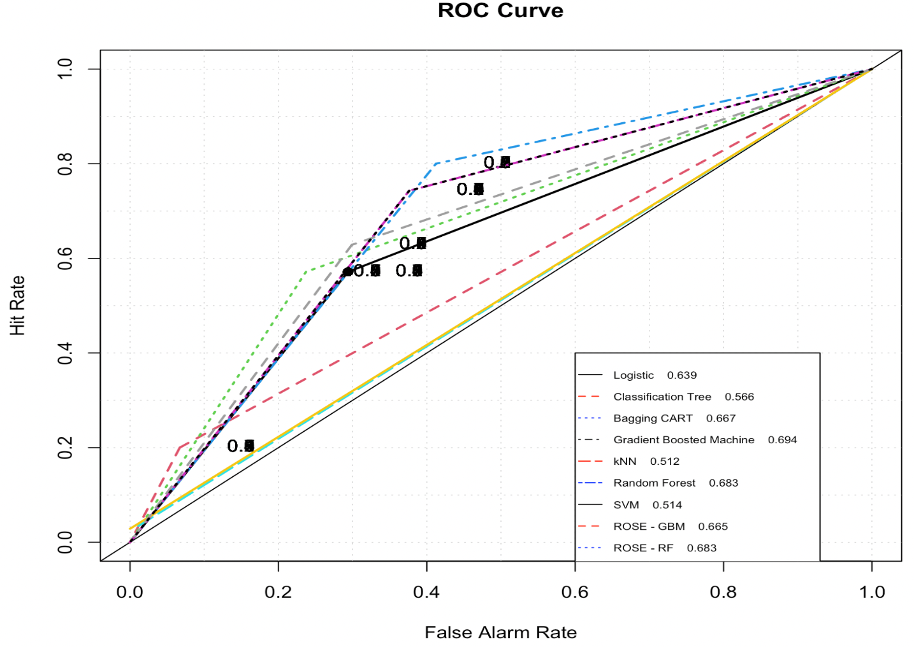

```{r setup, include=FALSE}
knitr::opts_chunk$set(echo = TRUE)
```

## Introduction & Background

The world health organization has collected information on potential individual factors in their relations to Kenyans who are suffering from untreated major depressive disorder. This project aims to examine the potential association between 75 individual-level features such as socioeconomic status and health indicators, and depression onset. The original data come from a 2015 study conducted by the Busara Center in rural Siaya County in western Kenya; all study participants were asked to complete depression screening to determine the outcome of interest. (The Original Link is here: https://zindi.africa/competitions/busara-mental-health-prediction-challenge/data). From this heterogeneous data, we aim to use regression in investigating the association, and use machine learning methods in predicting individual level depression.

### EDA

First, I checked for missing data included in our dataset. There are in total 23 out of 75 features that includes missing NAs. Since there are a huge number of features included, it is understandable that there are very few observations with no missing values at all. I proceeded with a naive approach by replacing the missing values with the mean for each feature.

I then chose to examine the covariates that I have a clear understanding for, since we need to understand potential correlations in the model and one cannot refer to epidemiological terminologies if they do not fully understand the nature of that factor. So we only have 20 features left for modeling the association. 

I proceeded with using an influence plot which graphs the studentized residuals against hat values ---- fitted values made by my logistic model, and the sizes and fill color of the red circles are proportional to Cook’s distance. We can see that there are around 4 points with large studentized residuals with their Cook’s distances labeled. We can see that although these 4 points are labeled because of their large residual values, none of the points have an absolute value larger than 3. Therefore one can temporarily conclude that there is no obvious outlier in our data set.


From the correlation matrix of all our covariates, we can observe that factors that are highly correlated (correlation > 0.6) include hhsize & children & hh_totalmembers & hhchildren, cons_nondurable and cons_allfood and cons_med_total. Therefore, we proceed to eliminate covariates that are highly correlated in our model. After further cleaning, we can obtain the VIP scores for most influential factors below. 

A VIP score is the measure of a variable's importance for the overall model. From the plot, we can observe that the factors that seem to be contributing the most to the outcome depression are the size of household, proportion of household sick or injured in the last month, marital status and years of education completed. These covariates mentioned seem to point to common sources of stress and emotional turbulence that may be introduced in one's life. From this data set, these factors seem to have high importance in explaining the variance of the dependent variable depression.

### Description  & justification of Methodology

The data set is heavily imbalanced with only 16% of participants having the outcome of interest. Using imbalanced data set may result in poor outcomes in the ROC-AUC result. Therefore we attempted to generate a sample of synthetic data by Randomly Over Sampling Examples (ROSE) which resulted in a roughly balanced data set to combat this problem. However, the degree of imbalance was still severe and generating synthetic data seem to worsen the prediction accuracy. Therefore, we moved forward with changing the cutoff threshold for prediction.

From the ROC curve of a general logistic regression fitted for this dataset in the exploratory data analysis, we can see that it comes quite closer to the diagonal line, indicating low accuracy. From the general model summary, we can also see that most of the covariates are not statistically significant in the classification. This may be due to the fact that the linearity assumption in the predictors does not hold well. 

Therefore we can conclude that this general linear model is not sufficient to depict the relationship of the covariates listed and the outcome of interest depression status. We proceed with other machine learning approaches that can hopefully better characterize the relationships between depression onset with socioeconomic and health factors. 


## Results

We first drop unnecessary features for our analysis such as village identifier, personal identification number and the survey date. We then create initial data partition for further examination using training set (containing 80% of observations) and test sets (containing 20% of observations). 


### ROC combined plot
  
I attempted several machine learning models with tuned parameters using tuneGrid of the caret package to specify customized parameters that I am interested in learning. Models include logistic regression, classification tree, decision tree using bootstrap aggregating method to reduce the variance, gradient boosted machine, k-nearest neigherbos, random forest and support vector machine. The combined ROC curves plot below shows a preliminary measure of the classification performances of these tuned models.
  
  As we can see from the ROC plots
  
#### ROSE 
  To remedy the effect of imbalanced data set on the overall classification performance, I also attempted to use ROSE package, which generates synthetic balanced data from the original information by random over-sampling. Through the ROSE function, I hoped to improve subsequent prediction.
  
### Shrinkage plot
  Below are how the RMSE changed based on different shrinkage value given to the gradient boosted machine using ROSE data and the original data.
  
  
### mtry plot
  
  
### Final Results
Why specificty & AUC/balanced accuracy
  


## Conclusion


## References
Data source: https://zindi.africa/competitions/busara-mental-health-prediction-challenge/data 


## Appendix

```{r}
library(tidyverse) 
library(dplyr)
library(dslabs)
library(ggplot2)
library(lubridate) 
library(caret)
library(HistData)
library(Lahman)
library(purrr)
library(pdftools)
library(broom)
library(stringr)
library(tidyr)
library(readr)
```


## Exploratory Data Analysis
```{r}
dat <- read_csv('./data/train.csv')
var_explain <- read_csv('./data/var_explain.csv')
var_explain
glimpse(dat)


dat$Class<-as.factor(dat$depressed) # convert class to factor
levels(dat$Class) <- c('not_depressed', 'depressed') # names of factors
summary(dat$Class)

```


```{r}
head(summary(dat))
```

```{r}
depressed_sub <- dat %>% filter(depressed == 1)
nrow(depressed_sub)
depressed_percent <- nrow(depressed_sub)/nrow(dat)
depressed_percent

prop.table(table(dat$depressed))
# EDA
ggplot(data = dat, aes(fill = Class)) +geom_bar(aes(x = Class))
```
```{r}
dat_depressed <- dat %>% filter(depressed == 1)
dat_notDepressed <- dat %>% filter(depressed == 0)
```


#### Missing Data
```{r}
#check for missing data
anyNA(dat)
sum(is.na(dat))
col_NA <- colnames(dat)[colSums(is.na(dat)) > 0]
col_NA
```

```{r}
#look at rows with missing data
dat_NA <- dat[!complete.cases(dat), ]
nrow(na.omit(dat))
#look at missing pattern
library(ggmice)
plot_pattern(dat[, col_NA])
```

```{r}
for(i in 1:length(col_NA)){
  dat[col_NA[i]][is.na(dat[col_NA[i]])] <- round(sum(dat[col_NA[i]], na.rm=TRUE)/nrow(dat))
}
anyNA(dat)
```

```{r}
cols <- colnames(dat)
cols
library(Hmisc)
hist.data.frame(dat)
```

#### Examine continuous covariates
```{r}
#family factors
pairs(depressed ~ age + children + hhsize + edu + hh_totalmembers + hh_children, dat)

#socio-economic indicating factors
pairs(depressed ~ cons_nondurable + asset_savings + cons_allfood + cons_med_total + cons_ed + cons_social + ent_total_cost, dat)

# life-style/financial factors
pairs(depressed ~ fs_adskipm_often + fs_meat + med_portion_sickinjured + ed_sch_missedpc + durable_investment, dat)
```


```{r}
dat_old <- dat
# Interested/understandable factors
cov <- c("age", "children", "hhsize", "edu" , "hh_totalmembers", "hh_children", "cons_nondurable", "asset_savings", "cons_allfood", "cons_med_total", "cons_ed", "cons_social", "ent_total_cost", "fs_adskipm_often", "fs_meat", "med_portion_sickinjured", "ed_sch_missedpc", "durable_investment", "femaleres", "married", "depressed")

dat <- dat[, cov]

hist.data.frame(dat)
```


```{r}
library(glmnet)
library(vip)
#define outcome variable
y <- dat[,"depressed"] |> as.matrix()
#define matrix of predictor variables
x <- dat[, c("age", "children", "hhsize", "edu" , "hh_totalmembers", "hh_children", "cons_nondurable", "asset_savings", "cons_allfood", "cons_med_total", "cons_ed", "cons_social", "ent_total_cost", "fs_adskipm_often", "fs_meat", "med_portion_sickinjured", "ed_sch_missedpc", "durable_investment", "femaleres", "married")] |> as.matrix()
elasticnet.mod = glmnet(x,y,alpha=0.5,family="binomial")
vip(elasticnet.mod, num_features=10, geom = "point")
```

```{r}
ggplot(dat, aes(age, depressed, color=factor(femaleres))) +
  stat_smooth(method="loess", formula=y~x,
              alpha=0.2, size=2, aes(fill=factor(femaleres))) +
  geom_point(position=position_jitter(height=0.03, width=0)) +
  xlab("Age") + ylab("depressed")
```

## Regression - Association
```{r}
mod_log <- glm(depressed ~ age + children + hhsize+edu + hh_totalmembers+ hh_children+ cons_nondurable+ asset_savings + cons_allfood+ cons_med_total+ cons_ed+ cons_social+ ent_total_cost+ fs_adskipm_often  + fs_meat + med_portion_sickinjured+ ed_sch_missedpc+ durable_investment+ femaleres + married, data = dat, family = "binomial")
summary(mod_log)

# Influence plot
library(car)
par(mfrow=c(1,1))
influencePlot(mod_log,col="red")
```

```{r}
covMatrix <- vcov(mod_log)
corrMatrix <- cov2cor(covMatrix)
head(corrMatrix) 
```


```{r}
#up sampling for imbalanced data
set.seed(260)
datdown <- downSample(x=dat[, -which(names(dat) == "depressed")], y=dat$depressed)
prop.table(table(datdown$y))

#ROSE algorithm
library(ROSE)
drose <- ROSE(depressed ~ ., N = 1900, data = dat, seed = 260)$data
table(drose$depressed)
```

```{r}
mod_log <- glm(depressed ~ age + children + hhsize + edu + cons_nondurable+ asset_savings + cons_ed+ cons_social+ ent_total_cost+ fs_adskipm_often  + fs_meat + med_portion_sickinjured+ ed_sch_missedpc+ durable_investment+ femaleres + married, data = drose, family = "binomial")
summary(mod_log)

influenceIndexPlot(mod_log)
```

```{r}
library(corrplot)
correlations <- cor(dat[, -12], use = "pairwise.complete.obs")
corrplot(correlations, method='number')
corrplot.mixed(correlations,upper = "circle", lower = "number", tl.col = "black", tl.pos = "lt") 
```


```{r}
summary(mod_log)$coefficients
library(pROC)
predprob <- predict(mod_log,type=c("response")) 
roccurve <- roc(drose$depressed ~ predprob)
plot(roccurve,col="red")
roccurve

library(rpart)
#build decision tree models
tree.rose <- rpart(depressed ~ ., data = drose)
pred.tree.rose <- predict(tree.rose, newdata = drose)
roc.curve(drose$depressed, pred.tree.rose)
```


```{r}
#calculate and intepret the coefficients the odds ratio and 95% CI
exp(cbind(OR = coef(mod_log), confint(mod_log)))
```

We can interpret these coefficients in terms of odds ratios. For example, for a one unit increase in the number of children one has, the odds of being depressed (versus not being depressed) increase by a factor of 1.1225961, on average, holding all other covariates fixed. 

```{r}
d <- read_csv('./data/train.csv')
d <- d[, !(names(d) %in% c("surveyid", "village", "survey_date"))]

na_cols <- names(which(colSums(is.na(d))>0))
d <- d[ , !(names(d) %in% na_cols)]

# d$Class<-as.factor(d$depressed) # convert class to factor
# levels(d$Class) <- c('not_depressed', 'depressed') # names of factors
# summary(d$Class)

# Correct imbalance in data
#ROSE algorithm
library(ROSE)
drose <- ROSE(depressed ~ ., N = 1143, data = d, seed = 260)$data
table(drose$depressed)

#Data partition
set.seed(260)
test_index <- createDataPartition(d$depressed, times = 1, p = 0.2, list = FALSE)
test_set <- d[test_index, ]
train_set <- d[-test_index, ]

#predictor / response definition
predictor_variables <- d[,-48]
response_variable <- d$depressed
#swap to have minority class coded as 1
levels(response_variable) <- c('0', '1') 
table(d$depressed)
```


### Logistic Regression with tuned parameter
```{r}
glm_train <- glm(depressed ~ ., data = train_set, family = "binomial")
summary(glm_train)
pred <- predict(glm_train, test_set, type="response")
pred <- as.integer(pred>0.18)
cm <- confusionMatrix(as.factor(pred), as.factor(test_set$depressed))


library(pROC)
library(verification)
roc.curve(test_set$depressed, pred)
auc_log <- as.numeric(auc(roc(test_set$depressed, pred)))


results <- tibble(Method = "Logistic Regression", AUC = auc_log,
                     F1 = cm$byClass["F1"], Specificity = cm$byClass["Specificity"], 
                     Balanced_Accuracy = cm$byClass["Balanced Accuracy"])
results
```


### Classification Tree
```{r}
library(rpart)
library(rpart.plot)
#build decision tree models on training set

tree.rose <- rpart(depressed~ ., data = train_set, method = 'class')
rpart.plot(tree.rose)
printcp(tree.rose)

pred.tree.rose <- predict(tree.rose, newdata = test_set, type = "prob")
pred.tree.rose <- as.integer(pred.tree.rose[,2]>0.2)
roc.curve(test_set$depressed, pred.tree.rose)

cm_tree <- confusionMatrix(as.factor(pred.tree.rose), as.factor(test_set$depressed))
auc_tree <- as.numeric(auc(roc(test_set$depressed, pred.tree.rose)))
result_tree <- tibble(Method = "Classification Tree", 
                                     AUC = auc_tree,
                                     F1 = cm_tree$byClass["F1"], 
                                     Specificity = cm_tree$byClass["Specificity"], 
                                     Balanced_Accuracy = cm_tree$byClass["Balanced Accuracy"])
results <- bind_rows(results, result_tree)
```

### Bagging CART

Bootstrapped Aggregation (Bagging) is an ensemble method that creates multiple models of the same type from different sub-samples of the same dataset. The predictions from each separate model are combined together to provide a superior result. This approach has shown participially effective for high-variance methods such as decision trees.

Here is bagging applied to the recursive partitioning decision tree for our depression dataset.
```{r}
library(ipred)
fit_ipred <- bagging(depressed~., data=train_set)
pred.ipred <- predict(fit_ipred, newdata = test_set)
pred.ipred <- as.integer(pred.ipred>0.2)

roc.curve(test_set$depressed, pred.ipred)
cm_ipred <- confusionMatrix(as.factor(pred.ipred), as.factor(test_set$depressed))

results <- bind_rows(results, tibble(Method = "Bagging", 
                      AUC = as.numeric(auc(roc(test_set$depressed, pred.ipred))),
                      F1 = cm_ipred$byClass["F1"], Specificity = cm_ipred$byClass["Specificity"],
                      Balanced_Accuracy = cm_ipred$byClass["Balanced Accuracy"]))
```


### kNN

```{r}
control <- trainControl(method = "cv",number = 5, p = .8, classProbs = TRUE)
train_knn <- train(train_set[, -which(names(train_set) == "depressed")],
                   make.names(train_set$depressed), method = "knn",
                   tuneGrid = data.frame(k = seq(3,10, 2)), trControl = control,
                   metric = "ROC", maximize = TRUE
                   )
train_knn
fit_knn <- knn3(train_set[, -which(names(train_set) == "depressed")],
                factor(train_set$depressed),  k = train_knn$bestTune$k)
y_hat_knn <- predict(fit_knn, test_set[, -which(names(train_set) == "depressed")], type="class")

cm_knn <- confusionMatrix(as.factor(y_hat_knn), as.factor(test_set$depressed))

roc.curve(test_set$depressed, y_hat_knn)

results <- bind_rows(results, tibble(Method = "kNN", AUC = as.numeric(auc(roc(as.numeric(test_set$depressed), as.numeric(y_hat_knn)))),
                      F1 = cm_knn$byClass["F1"], Specificity = cm_knn$byClass["Specificity"],
                      Balanced_Accuracy = cm_knn$byClass["Balanced Accuracy"]))
```


### Random Forest

```{r}
control <- trainControl(method = "cv",number = 5, p = .8)
grid <- data.frame(mtry=c(1, 5, sqrt(ncol(d)), 10))
train_rf <- train(train_set[, -which(names(train_set) == "depressed")],
                   train_set$depressed, method = "rf",
                   tuneGrid = grid, trControl = control,
                  metric = "F1", maximize = TRUE)
train_rf$bestTune
ggplot(data = NULL, aes(x = train_rf$results$mtry, y = train_rf$results$RMSE)) + 
  geom_line(colour = 'red') + geom_point() + labs(title = "mtry vs. RMSE") + xlab("mtry") + 
  ylab("RMSE")
  


library(randomForest)
fit_rf <- randomForest(depressed~., data=train_set, mtry = train_rf$bestTune$mtry)
y_hat_rf <- predict(fit_rf, test_set)
y_hat_rf <- as.integer(y_hat_rf>0.18)
roc.curve(test_set$depressed, y_hat_rf)
cm_rf <- confusionMatrix(factor(y_hat_rf), factor(test_set$depressed))

results <- bind_rows(results, tibble(Method = "Random Forest", AUC = as.numeric(auc(roc(test_set$depressed, y_hat_rf))),
                      F1 = cm_rf$byClass["F1"], Specificity = cm_rf$byClass["Specificity"],
                      Balanced_Accuracy = cm_rf$byClass["Balanced Accuracy"]))
```


### Gradient Boosted Machine

```{r}
library(gbm)

grid_gbm <- expand.grid(n.trees = 200, interaction.depth = 3, shrinkage = seq(0.1, 0.9, 0.05), 
                        n.minobsinnode = 10)

train_gbm <- train(depressed ~ ., data = train_set, method = "gbm", trControl = control,
                   verbose = FALSE, tuneGrid = grid_gbm, metric = "F1", maximize = TRUE)
train_gbm$bestTune
ggplot(data = NULL, aes(x = train_gbm$results$shrinkage, 
                        y = train_gbm$results$RMSE)) + geom_point()+ geom_line(colour = 'red') +
  geom_point() + labs(title = "shrinkage vs. RMSE") + xlab("shrinkage") + ylab("RMSE")


fit_gbm <- gbm(depressed ~., data=train_set, distribution = "bernoulli")
y_hat_gbm <- predict(fit_gbm, test_set)
y_hat_gbm <- as.integer(y_hat_gbm>-1.55)
roc.curve(test_set$depressed, y_hat_gbm)

cm_gbm <- confusionMatrix(as.factor(y_hat_gbm), as.factor(test_set$depressed))

results <- bind_rows(results, tibble(Method = "Gradient Boosted Machine", AUC = as.numeric(auc(roc(test_set$depressed, y_hat_gbm))),
                      F1 = cm_gbm$byClass["F1"], Specificity = cm_gbm$byClass["Specificity"],
                      Balanced_Accuracy = cm_gbm$byClass["Balanced Accuracy"]))
```

### SVM
```{r}
library(e1071)
train_svm <- train(depressed ~ ., data = train_set, method = "svmRadial", trControl = control,
                   verbose = FALSE, metric = "F1", maximize = TRUE)

fit_svm <- svm(depressed ~ ., data=train_set, type = "C-classification", kernel = "radial")
y_hat_svm <- predict(fit_svm, newdata = test_set, type = "decision")

cm_svm <- confusionMatrix(as.factor(y_hat_svm), as.factor(test_set$depressed))

roc.curve(test_set$depressed, y_hat_svm)

results <- bind_rows(results, tibble(Method = "SVM", AUC = as.numeric(auc(roc(as.numeric(test_set$depressed), as.numeric(y_hat_svm)))),
                      F1 = cm_svm$byClass["F1"], Specificity = cm_svm$byClass["Specificity"],
                      Balanced_Accuracy = cm_svm$byClass["Balanced Accuracy"])) 
```


## ROSE data

From results before, Random Forest and Gradient Boosted Machine seem to perform the best in terms of balanced accuracy and specificity measure. Here we attempt these 2 models with resampled balanced data.

```{r}
table(drose$depressed)

#Data partition
set.seed(260)
test_index <- createDataPartition(drose$depressed, times = 1, p = 0.2, list = FALSE)
test_rose <- d[test_index, ]
train_rose <- d[-test_index, ] 
```

#### Random Forest
```{r}
control <- trainControl(method = "cv",number = 5, p = .8)
grid <- data.frame(mtry=c(1, 5, sqrt(ncol(drose))))
train_rf_rose <- train(train_rose[, -which(names(train_rose) == "depressed")],
                  train_rose$depressed, method = "rf", tuneGrid = grid, trControl = control,
                  metric = "F1", maximize = TRUE)
train_rf_rose$bestTune


fit_rf_rose <- randomForest(depressed~., data=train_rose, mtry = train_rf_rose$bestTune$mtry)
y_rose_rf <- predict(fit_rf_rose, test_rose)
y_rose_rf <- as.integer(y_hat_rf>0.18)
roc.curve(test_rose$depressed, y_rose_rf)
cm_rf_rose <- confusionMatrix(factor(y_rose_rf), factor(test_rose$depressed))

results <- bind_rows(results, tibble(Method = "ROSE - Random Forest", 
                       AUC = as.numeric(auc(roc(test_rose$depressed, y_rose_rf))),
                       F1 = cm_rf_rose$byClass["F1"], 
                       Specificity = cm_rf_rose$byClass["Specificity"],
                       Balanced_Accuracy = cm_rf_rose$byClass["Balanced Accuracy"]))
```


### Gradient Boosted Machine
```{r}
library(gbm)
train_gbm_rose <- train(depressed ~ ., data = train_rose, method = "gbm", trControl = control,
                   verbose = FALSE, tuneGrid = grid_gbm, metric = "F1", maximize = TRUE)
#train_gbm_rose$bestTune


fit_gbm_rose <- gbm(depressed ~., data=train_rose, distribution = "bernoulli")
y_rose_gbm <- predict(fit_gbm_rose, test_rose)
y_rose_gbm <- as.integer(y_rose_gbm>-1.55)
roc.curve(test_rose$depressed, y_rose_gbm)

cm_gbm_rose <- confusionMatrix(as.factor(y_rose_gbm), as.factor(test_rose$depressed))

results <- bind_rows(results, tibble(Method = "ROSE - Gradient Boosted Machine", 
                                     AUC = as.numeric(auc(roc(test_rose$depressed, y_rose_gbm))),
                                     F1 = cm_gbm_rose$byClass["F1"], 
                                     Specificity = cm_gbm_rose$byClass["Specificity"],
                                     Balanced_Accuracy = cm_gbm_rose$byClass["Balanced Accuracy"]))

ggplot(data = NULL, aes(x = train_gbm_rose$results$shrinkage, 
                        y = train_gbm_rose$results$RMSE)) + 
  geom_point()+ geom_line(colour = 'red') +
  geom_point() + labs(title = "shrinkage vs. RMSE") + xlab("shrinkage") + ylab("RMSE")

```

## Results
```{r}
results
```

```{r}
thresh<-seq(0,1,0.001)
roc.plot(x=test_set$depressed == "1", 
         pred = cbind(pred, pred.tree.rose, pred.ipred, y_hat_gbm, y_hat_knn, y_hat_rf, y_hat_svm, y_rose_gbm, y_rose_rf), legend = T, thresholds = thresh, leg.text = 
         c("Logistic","Classification Tree","Bagging CART", "Gradient Boosted Machine","kNN",
           "Random Forest", "SVM", "ROSE - GBM", "ROSE - RF"))$roc.vol
```


```{r ref.label=knitr::all_labels(), echo=TRUE, eval=FALSE}
```
